# Silent Hill: United

Silent Hill: United is an unofficial PC multiplayer mod project for Silent Hill 1.

Step back into Silent Hill with another player at your side: fight through the town together, keep track of each other on the map, and experience a custom multiplayer presentation built around Harry and Lisa.

This repository is used only for public releases, update metadata, and distribution files.
The source code is not hosted here.

## Community

Join the Discord server to follow Silent Hill: United development, release news, and multiplayer testing:

https://discord.gg/dXqEzN54s

The same community also follows Resident Evil: United, a modern-engine multiplayer recreation inspired by Resident Evil 1, with elements combined from Resident Evil 3.

## Highlights

### In-Game Online Lobby

Multiplayer starts inside Silent Hill: United. Open `MULTIPLAYER GAME`, enter the online lobby, and create or join a room from inside the game. The official server lists rooms by owner, status, player count, and ping, so there is no VPN setup, no external matchmaking tool, and no extra ritual before entering town. If both players are on the same home network, LAN play is still available as an alternative.

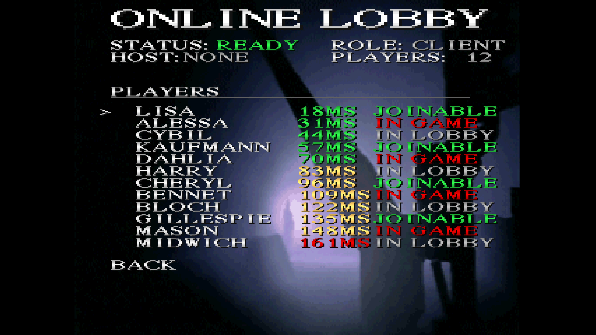

How to play online with another person:

1. Download the latest public release package from the Releases page.
2. Follow [INSTALL.md](INSTALL.md) and place your own legal Silent Hill 1 disc image in the required ROM folder.
3. Start `Launcher.exe`.
4. Use the launcher updater first if you need to move to the latest `Release` build.
5. Launch the game from the launcher.
6. In the main menu, choose `MULTIPLAYER GAME`, then `ONLINE`.
7. Enter or confirm your player name if the game asks for one.
8. To host, choose `Create Room`, wait for another player to join, adjust `Settings` if needed, then choose `START NEW GAME` or `LOAD GAME`.
9. To join, select an open room marked `Wait` and `>Join`, confirm the room, then wait for the host to start.
10. Start playing once both players are in the same room and the host begins the session.

Room status tips:

- `Wait` means the room is open and has a free player slot.
- `Full` means the room already has both players.
- `In game` means the room owner is already playing.
- `VER` means the room is using a different compatible-version group.
- `LAN` means the room appears to be on the same local network.
- High ping can cause delay, desync, or unstable sessions.

If you cannot see or join another room, make sure both players are using the same release channel and version, both games are allowed through the Windows firewall, and both players have restarted the lobby after updating. For two PCs on the same home network, LAN play is also available.

Example online flow:

| Browse rooms | Scroll long room lists |
| --- | --- |
| 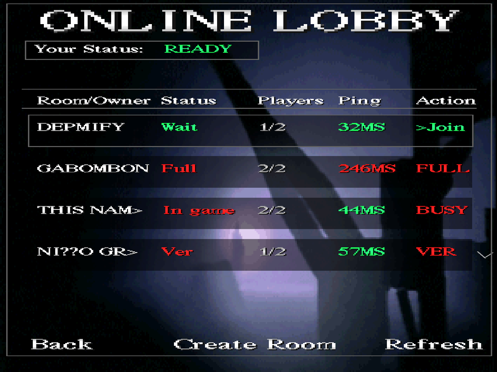 | 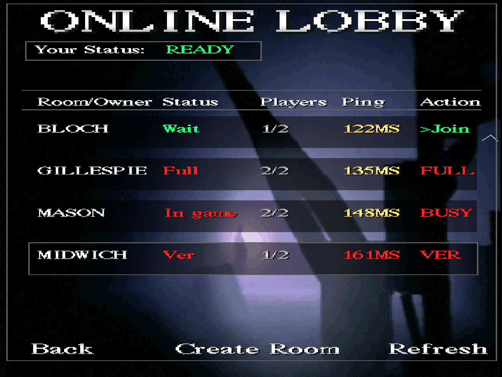 |

| Join a room | Host a room |
| --- | --- |
| 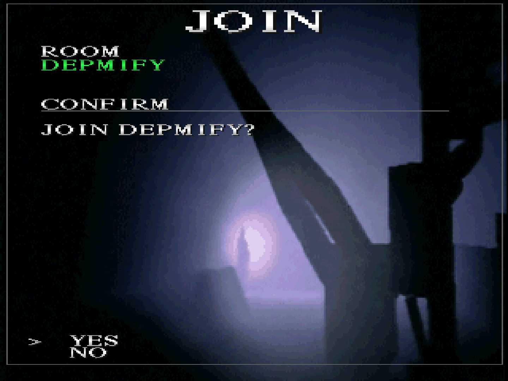 | 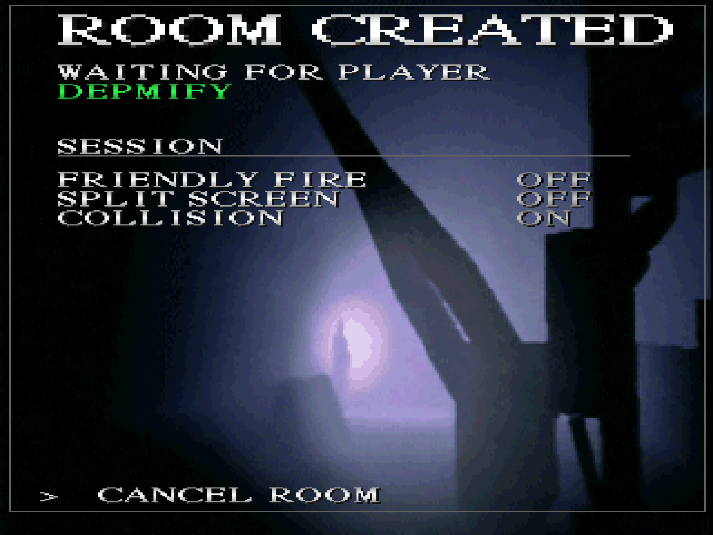 |

| Start as host | Adjust host settings | Wait as client |
| --- | --- | --- |
| 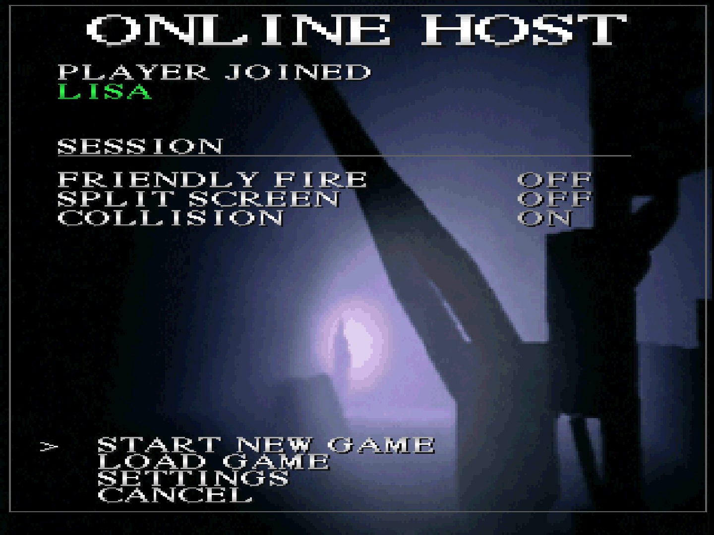 | 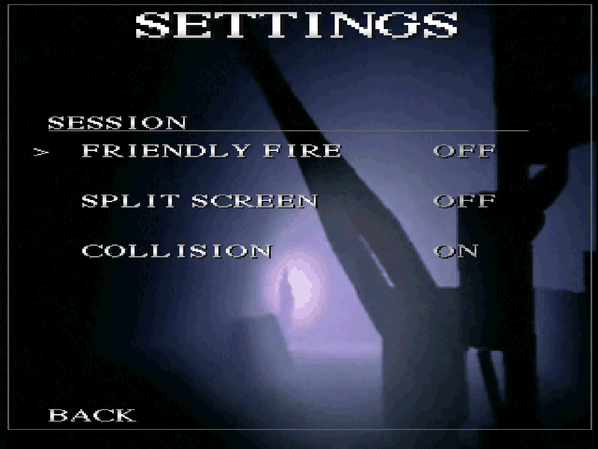 | 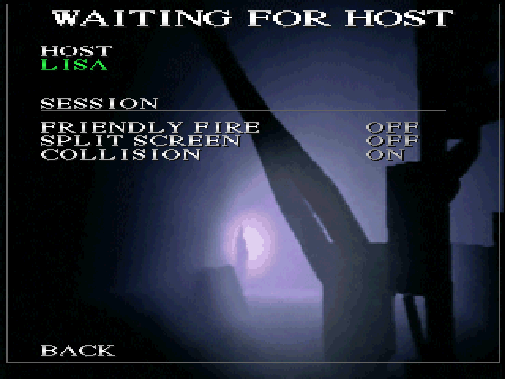 |

### Cooperative Combat

Silent Hill feels different when you are not alone. Harry and Lisa can stand together in the same scene, cover each other in tight corridors, and turn enemy encounters into tense co-op moments instead of solitary survival.

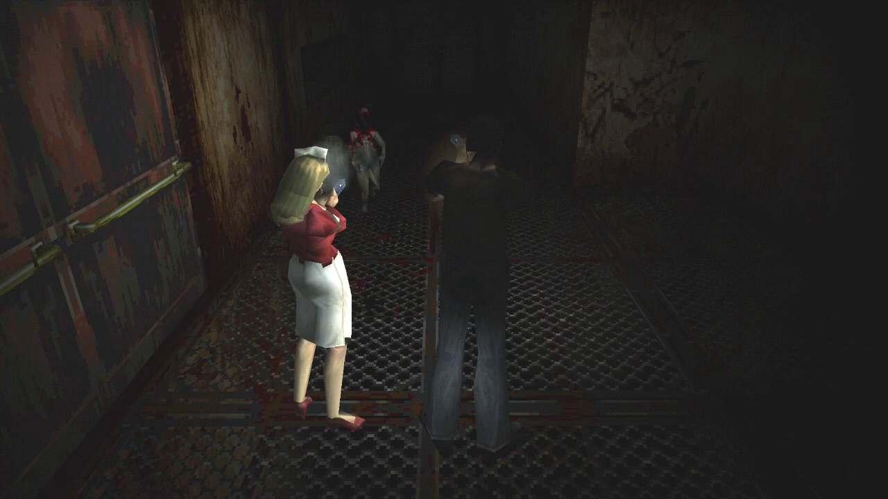

### Real-Time Companion Map

Find your partner without breaking the atmosphere. The map shows both players in real time, making it easier to regroup, split up, and navigate Old Silent Hill while still preserving the original map-driven feel.

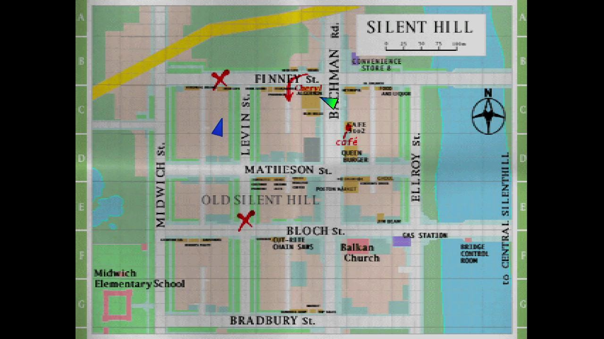

### Explore Silent Hill Together

The mod is built around shared presence: both players can move through story spaces, investigate locations, and experience the town as a pair while keeping the visual tone of the original PC experience.

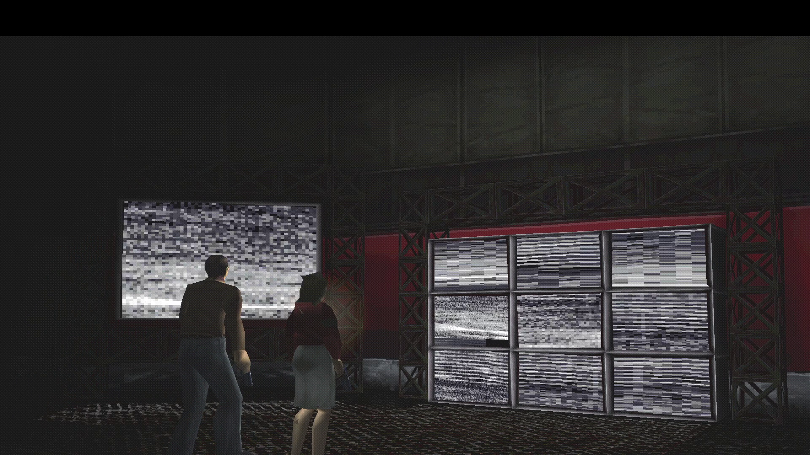

### Lisa's Exclusive Inventory Look

Lisa is not just a second player marker. Her inventory presentation gets its own identity, including a Lisa portrait and a UI style that makes her feel like a real playable partner instead of a duplicated Harry.

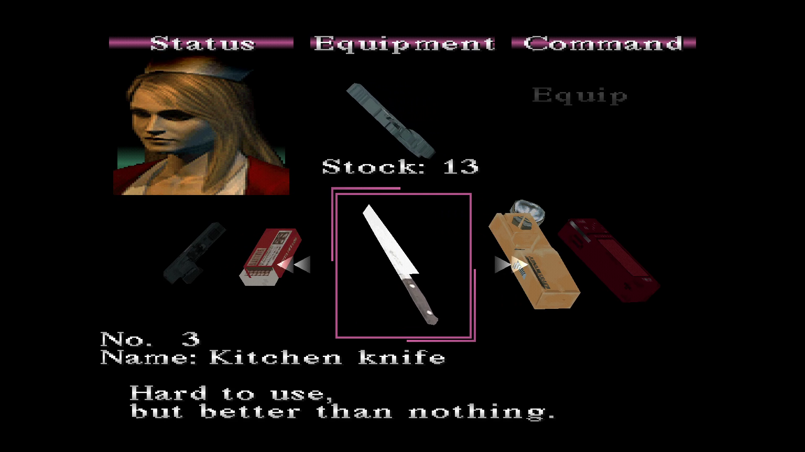

## Download

Get the latest version from the Releases page:

https://github.com/Depmify/Silent-Hill-United-Public-/releases

Do not clone this repository to install the mod. Use the latest release package instead.

For setup steps, see [INSTALL.md](INSTALL.md).

## Release Channels

- Release: stable public builds intended for normal play.
- Nightly: experimental prerelease builds for testing the latest work.

Update manifests may be provided per channel:

```text
manifest-release.json
manifest-nightly.json
manifest.json
```

## What This Repository Contains

- Public release builds
- Update manifest files
- Changelogs
- Installation notes
- Public screenshots and highlight media

## What This Repository Does Not Contain

- Source code
- Original Silent Hill game files
- Disc images, ROMs, ISOs, or original game content files
- Internal debug symbols or development tools

## Requirements

- Windows PC
- A valid copy of Silent Hill 1 / compatible PC setup
- Network access for multiplayer features

See [INSTALL.md](INSTALL.md) for download, setup, update, and package notes.

## Updating

The launcher may check this repository for the latest public version using the update manifest.

Example update metadata:

```json
{
  "version": "0.1.0",
  "channel": "Release",
  "url": "https://github.com/Depmify/Silent-Hill-United-Public-/releases/download/v0.1.0/Silent-Hill-United-v0.1.0.zip",
  "sha256": "SHA256_HASH_HERE",
  "mandatory": false
}
```

## Status

This project is experimental and under active development. Multiplayer stability is the current priority.

## Credits

Special thanks to [Vatuu/silent-hill-decomp](https://github.com/Vatuu/silent-hill-decomp) and its contributors for the Silent Hill 1 decompilation work that helped make this project possible.

## Disclaimer

Silent Hill is owned by its respective rights holders.
This is an unofficial fan project and is not affiliated with or endorsed by Konami.

No original game files, disc images, ROMs, or ISOs are distributed in this repository.

## Support

For bugs, crashes, multiplayer issues, or feature requests, open an issue using the matching GitHub issue template.

Useful details include:

- Mod version
- Release channel
- Windows version
- What you were doing when the issue happened
- Crash log or error message, if available
